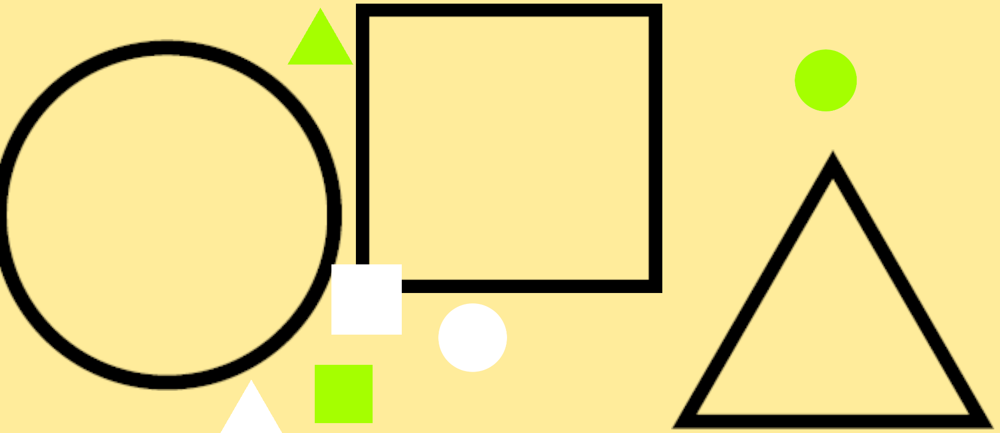

ゲーム制作技術総合実習 個人ワーク
（Circle, Triangle, Squareを使用した2Dゲーム）

# (STS)

## ゲームの内容
無説明図形グルーピングゲーム
図形に共通する点を見つけてそれごとにグルーピングしていくゲームでクリアタイムをはかる。
これから面を増やしていき制限時間で何面までクリアできるか競うゲームにしたい。

## 操作説明
ドラッグアンドドロップのみで図形を移動させる